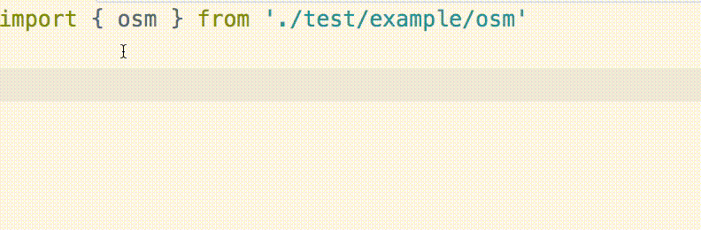
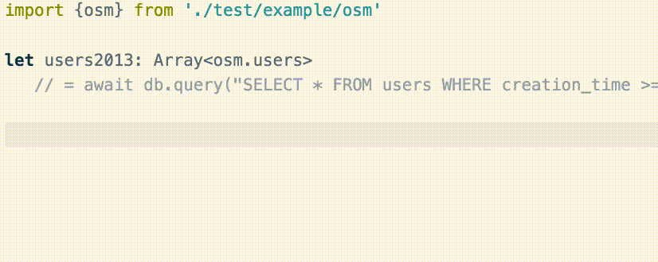

# schemats

[](https://www.npmjs.com/package/schemats)
[](https://github.com/SweetIQ/schemats)
[](https://circleci.com/gh/SweetIQ/schemats)

Generate typecript interface definitions from (postgres) SQL database schema

## Quick Start

### Installing Schemats

```
npm install -g schemats
```

### Generating the type definition from schema

```
schemats generate -c postgres://postgres@localhost/osm -t users osm.ts -n osm
```


The command above will generate typescript interfaces for [`osm`](test/osm_schema.sql) database 
with table [`users`](test/osm_schema.sql#L18) under namespace `osm`. The resulting file is stored as [`osm.ts`](test/example/osm.ts).


### Writing code with typed schema

We can import `osm.ts` directly

```typescript

// imports the _osm_ namespace from ./osm.ts

import {osm} from './osm'


// Now query with pg-promise and have a completely typed return value
  
let usersCreatedAfter2013: Array<osm.users>
   = await db.query("SELECT * FROM users WHERE creation_time >= '2013-01-01'");

// We can decide to only get selected fields

let emailOfUsersCreatedAfter2013: Array<{
    email: osm.usersFields.email,
    creation_time: osm.usersFields.creation_time
}> = await db.query("SELECT (email, creation_time) FROM users WHERE creation_time >= '2013-01-01'");

// osm.usersFields.name is just a type alias to string
// and osm.usersFields.creation_time is just a type alias to Date
// Hence the one below also works

let emailOfUsersCreatedAfter2013: Array<{
    email: string,
    creation_time: Date
}> = await db.query("SELECT (email, creation_time) FROM users WHERE creation_time >= '2013-01-01'");
```

With genearted type definition for our database schema, we can write code with autocompletion and static type checks.

<p align="center">

</p>
<p align="center">

</p>

### Using schemats as a library

Schemats exposes two high-level functions for generating typescript definition from a database schema. They can be used by a build tool such as grunt and gulp.
